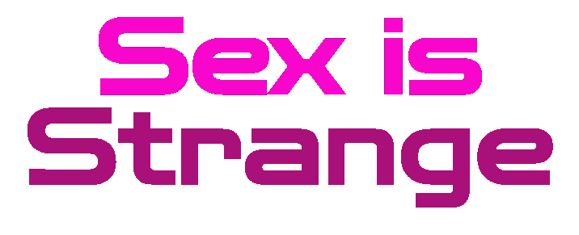

<div align="center">

</div>

> Team : [Pierre CREPIN](https://github.com/Pierrecrp1), [Tom VALLART](https://github.com/Tom6213)</a>, [Frédéric DOURNEL](https://github.com/Fredericdrnl), Benjamin FOURNIER, Florian LAVIE, Hugo HALLOT, Paul HURDEBOURCQ.

## Goal of this project 

This project was made during the night of computing 2022 event when we have to made a website in one night for prevention on the subject of STDs. For that we took the choice to make a choice game with consequences on the answers chosen.

<div align="center">

</div>

<sub>the night of computing event : https://www.nuitdelinfo.com </sub>

## Technologies use ⚙️

For this project, we use the javascript framework *Vue.js*.

<div align="center">

</div>


<sub>Vue.js : https://vuejs.org</sub>

## How to use ❓

### Project Setup

```
npm install
```

### Compile and Hot-Reload for Development

```
npm run dev
```

### Compile and Minify for Production

```
npm run build
```
